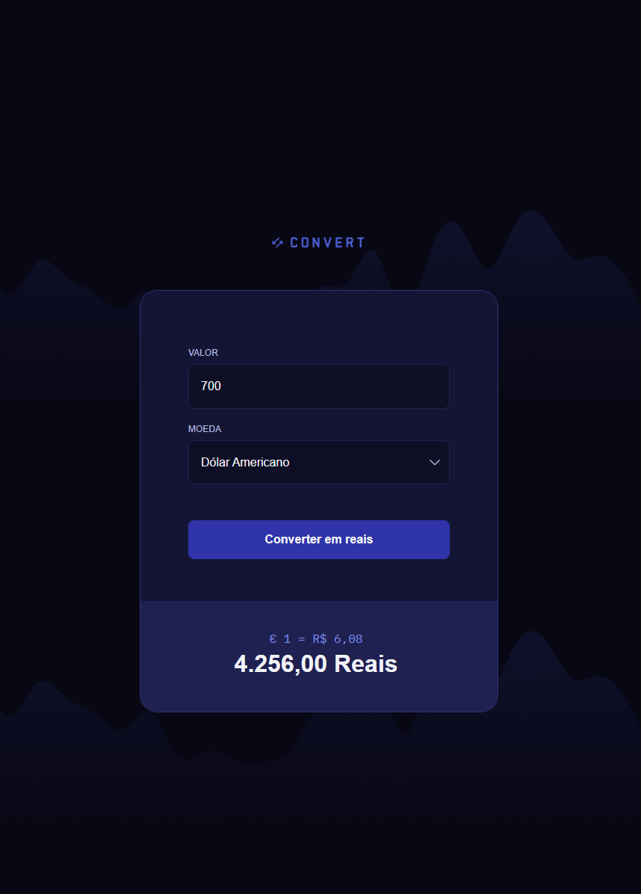

# Projeto Convert

Projeto Convert é um aplicativo web que converte valores de outras moedas para reais.

[](https://convert.hallanchristian.com.br)

## Visão Geral

O Projeto Convert é uma aplicação moderna e responsiva que permite converter valores monetários para reais. A interface conta com animações sutis em CSS (Animations e Transitions) para melhorar a experiência do usuário.

## Tecnologias Utilizadas

- **JavaScript**: Lógica de interação, cálculo e validação de valores.
- **HTML5**: Estrutura semântica da página.
- **CSS3**: Estilização e design visual.
  - **Grid** e **Flexbox**: Para alinhamento e distribuição responsiva dos elementos.

## Funcionalidades

1. **Conversão de valor**: Inserir valor em outra moeda (ou, se for apenas um valor bruto, converter diretamente para reais).
2. **Seleção de moeda de origem** (caso queira estender para várias moedas) e conversão para reais.
3. **Formatação de saída**: Exibe o resultado formatado como moeda brasileira (R$).
4. **Validação de entrada**: Não permite valores negativos ou entradas inválidas (letras, símbolos indevidos etc.).

## Como Executar o Projeto

1. Clone o repositório:
   ```bash
   git clone https://github.com/hallancma/mba-rockeseat-sirius-projetos-07-projeto-convert
   ```
2. Acesse a pasta do projeto:
   ```bash
   cd mba-rockeseat-sirius-projetos-07-projeto-convert
   ```
3. Abra o `index.html` em seu navegador:
   - Basta clicar duas vezes no arquivo, ou:
     ```bash
     open index.html
     ```
   - Opcionalmente, use um servidor HTTP local para testar (ex.: `npx http-server`), e acesse `http://localhost:8080`.

## Exemplos de Uso

- Ao abrir a página, há um campo para digitar o valor e, se aplicável, selecionar a moeda de origem.
- Botão “Converter”: ao clicar, valida o valor e exibe o resultado em reais.
- Mensagens de erro exibidas caso a entrada seja inválida (ex.: “Digite um valor numérico maior que zero”).

## Ver Projeto

Para ver em funcionamento, acesse:  
https://convert.hallanchristian.com.br/

---
